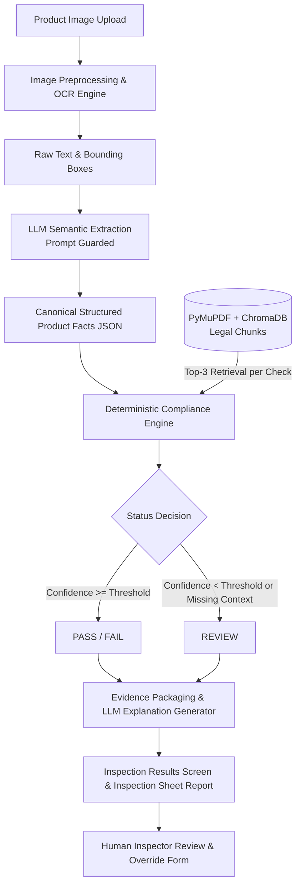

# MVP BUILD SPECIFICATION — 5-DAY PROTOTYPE

**Project:** Packaged Commodities Compliance Checker  
**Problem Statement:** SIH 2026 — PS 34  
**Target Delivery:** 5-Day College Prototype  
**Baseline Documents:** `MASTER_BUILD_SPEC.md`, `RULE_MATRIX.md`  
**Technology Stack:** FastAPI (Python) + SQLite + ChromaDB + React (Vite)  
**Status:** AUTHORITATIVE IMPLEMENTATION GUIDE

---

## 1. Executive Summary & Philosophy

This specification defines the exact scope, architecture, data contracts, and implementation plan for building a functional 5-day prototype.

### Core Operating Tenets
1. **Deterministic Compliance Core:** The system evaluates compliance via deterministic Python rules. **An LLM is NEVER the legal decision-maker.**
2. **Restricted LLM Role:** LLMs are strictly confined to:
   - Extracting structured key-value facts from raw OCR tokens.
   - Generating user-friendly explanations quoting deterministic results and legal citations.
3. **Conservative Default (Ambiguity $\rightarrow$ REVIEW):**
   - If image resolution or OCR confidence is below thresholds, output `REVIEW`.
   - If field presence cannot be confirmed, output `REVIEW` or note visible surface limits.
   - **Never hallucinate or invent legal interpretations.**
4. **Traceable RAG Grounding:** Every evaluated check must be backed by top-3 retrieved legal clauses directly from the authoritative legal corpus (`rules2011.pdf`, `rules2009.pdf`).

---

## 2. Prototype Scope Boundary

```
+--------------------------------------------------------------------------------+
|                                    SCOPE                                       |
+--------------------------------------------------------------------------------+
| CORE (Must Deliver):                                                           |
|   - CHK-01: Product Name Present                [Rule 6(1)(b)]                 |
|   - CHK-02: Net Quantity & Standard SI Units    [Rule 6(1)(c), Rule 13]        |
|   - CHK-03: Retail Sale Price (MRP + Taxes)     [Rule 6(1)(e), Rule 2(m)]      |
|   - CHK-04: Manufacturer/Packer/Importer Details [Rule 6(1)(a), Rule 10]       |
|   - CHK-05: Manufacturing/Packing Month & Year  [Rule 6(1)(d)]                 |
|   - CHK-06: Consumer Care Contact Information   [Rule 6(2)]                    |
|                                                                                |
| STRETCH (Add if Ahead of Schedule):                                            |
|   - CHK-07: Prohibited Quantity Qualifiers      [Rule 12(6)]                   |
|   - CHK-09: Country of Origin (Imported Goods)  [Rule 6(1)(a), Rule 10(1)]     |
|                                                                                |
| EXCLUDED FROM MVP (Do NOT Implement):                                          |
|   - CHK-08 (Language Script Detection - Hindi/English)                         |
|   - CHK-10 (MRP Sticker Alteration / Overwriting Detection)                    |
|   - Font-size compliance measurements (Rule 7 Tables I/II)                     |
|   - Color contrast ratio calculations (Rule 9(1)(b))                           |
|   - Physical package weighing / net content physical verification              |
|   - Standard pack-size schedule verification (Second Schedule / Rule 5)        |
|   - Deceptive packaging / non-functional slack fill (Rule 23)                  |
|   - Multi-surface inner vs. outer wrapper hierarchy analysis                   |
|   - Statutory legal inspection sampling protocols (Rules 19-22)                |
|   - Complex cross-statute reasoning (e.g., FSSAI, Seeds Act, Drugs/Cosmetics)  |
+--------------------------------------------------------------------------------+
```

---

## 3. End-to-End System Pipeline



### Flow Walkthrough
1. **Upload:** User provides a single product image via React frontend (`POST /api/v1/inspections`).
2. **OCR:** Image is processed by Google Cloud Vision API (fallback: Tesseract) to obtain full text and word-level coordinates.
3. **Structured Facts (LLM-assisted):** Gemini parses raw text into a strict, validated Pydantic JSON schema.
4. **RAG Retrieval:** The system retrieves top-3 relevant legal chunks from ChromaDB for the active checks.
5. **Deterministic Validation:** Pure Python rule functions evaluate the structured facts against the legal constraints.
6. **Output Generation:** Engine produces PASS, FAIL, or REVIEW, binds evidence bounding boxes, attaches official citations, and compiles an inspection summary.
7. **Human-in-the-Loop:** Inspector views annotated image, examines cited rules, and can override findings or enter notes.

---

## 4. Structured Data Contracts

### 4.1 Canonical OCR Structured Facts Schema

```json
{
  "inspection_id": "uuid-string",
  "overall_confidence": 0.88,
  "image_quality": "good",
  "raw_text": "Sample brand Parle-G Gold Net Wt. 200g MRP Rs. 20.00 incl. of all taxes Mfd 08/2026...",
  "fields": {
    "product_name": {
      "value": "Parle-G Gold Biscuits",
      "confidence": 0.92,
      "raw_text": "Parle-G Gold",
      "bounding_box": {"x": 120, "y": 50, "width": 300, "height": 40}
    },
    "net_quantity": {
      "value": {
        "numeric": 200.0,
        "unit": "g"
      },
      "confidence": 0.95,
      "raw_text": "Net Wt. 200g",
      "bounding_box": {"x": 150, "y": 400, "width": 100, "height": 25}
    },
    "mrp": {
      "value": {
        "amount": 20.0,
        "currency": "INR",
        "includes_tax": true,
        "tax_declaration_text": "incl. of all taxes"
      },
      "confidence": 0.91,
      "raw_text": "MRP Rs. 20.00 incl. of all taxes",
      "bounding_box": {"x": 100, "y": 450, "width": 250, "height": 25}
    },
    "manufacturer": {
      "value": {
        "name": "Parle Products Pvt. Ltd.",
        "address": "Vile Parle (East), Mumbai, Maharashtra - 400057",
        "role": "manufacturer"
      },
      "confidence": 0.87,
      "raw_text": "Mfd. by: Parle Products Pvt. Ltd., Mumbai - 400057",
      "bounding_box": {"x": 50, "y": 500, "width": 400, "height": 60}
    },
    "packer": null,
    "importer": null,
    "manufacturing_date": {
      "value": {
        "month": 8,
        "year": 2026,
        "format": "MM/YYYY"
      },
      "confidence": 0.85,
      "raw_text": "Mfg. Date: 08/2026",
      "bounding_box": {"x": 50, "y": 560, "width": 180, "height": 20}
    },
    "consumer_care": {
      "value": {
        "phone": "1800-22-1929",
        "email": "cs@parle.biz",
        "address": null
      },
      "confidence": 0.84,
      "raw_text": "Toll Free: 1800-22-1929, cs@parle.biz",
      "bounding_box": {"x": 50, "y": 620, "width": 350, "height": 30}
    },
    "country_of_origin": {
      "value": null,
      "confidence": null,
      "raw_text": null,
      "bounding_box": null
    }
  },
  "quantity_qualifiers_detected": [],
  "is_imported_hint": false
}
```

*Rule: Missing fields MUST be `null`, never empty strings, `"N/A"`, or `"not found"`.*

---

### 4.2 Compliance Engine Output Schema

```json
{
  "inspection_id": "uuid-string",
  "timestamp": "2026-09-05T12:00:00Z",
  "overall_status": "PASS",
  "compliance_score": 100.0,
  "summary": {
    "total_checks": 6,
    "passed": 6,
    "failed": 0,
    "review": 0
  },
  "checks": [
    {
      "check_id": "CHK-01",
      "rule_name": "Product Name Declaration",
      "status": "PASS",
      "severity": "CRITICAL",
      "detected_value": "Parle-G Gold Biscuits",
      "expected": "Non-empty generic or common commodity name",
      "confidence": 0.92,
      "reason": "Common commodity name found with high confidence.",
      "evidence": {
        "raw_text": "Parle-G Gold",
        "bounding_box": {"x": 120, "y": 50, "width": 300, "height": 40}
      },
      "legal_source": {
        "citation": "Rule 6(1)(b), The Legal Metrology (Packaged Commodities) Rules, 2011",
        "page": 5,
        "text": "The common or generic names of the commodity contained in the package..."
      }
    }
  ],
  "disclaimers": [
    "AI-assisted preliminary assessment under Legal Metrology Rules, 2011.",
    "Absence of text in single-angle OCR does not guarantee absence on non-visible physical package panels.",
    "Official enforcement requires verification by an authorized Legal Metrology Officer."
  ]
}
```

---

## 5. Deterministic Compliance Rules & Thresholds

Each rule is implemented as a standalone, pure-python validator.

### 5.1 Confidence & Decision Matrix
- If an entity is detected with `confidence < 0.70` $\rightarrow$ **REVIEW**
- If an entity is absent and `overall_confidence >= 0.80` $\rightarrow$ **FAIL**
- If an entity is absent and `overall_confidence < 0.80` $\rightarrow$ **REVIEW** (blurry/angled photo edge case)

```
Overall Status Resolution:
- If ANY check is "FAIL"   --> Overall = "FAIL"
- Else if ANY is "REVIEW"  --> Overall = "REVIEW"
- Else                     --> Overall = "PASS"
```

### 5.2 Rule Definitions

| ID | Check Name | Legal Authority | Input Field | Logic & Pass/Fail Criteria |
|---|---|---|---|---|
| **CHK-01** | Product Name | Rule 6(1)(b), Page 5 | `fields.product_name` | **PASS:** Value is non-empty string with confidence $\ge 0.70$.<br>**FAIL:** Value is null and image confidence $\ge 0.80$.<br>**REVIEW:** Value is null with image confidence $< 0.80$, or field confidence $< 0.70$. |
| **CHK-02** | Net Quantity & SI Units | Rule 6(1)(c), Rule 13(5), Pages 5, 14 | `fields.net_quantity` | **PASS:** Numeric value $> 0$, unit is valid SI (`g`, `kg`, `ml`, `l`, `m`, `cm`, `mm`, `n`, `u`), confidence $\ge 0.70$.<br>**FAIL:** Null quantity (conf $\ge 0.80$), non-SI unit (e.g., `oz`, `lbs`, `fl oz`), or non-positive quantity.<br>**REVIEW:** Unrecognized unit string or confidence $< 0.70$. |
| **CHK-03** | MRP & Tax Inclusivity | Rule 6(1)(e), Rule 2(m), Pages 3, 6 | `fields.mrp` | **PASS:** Numeric amount $> 0$ AND `includes_tax == True` (`"incl. of all taxes"` detected).<br>**FAIL:** MRP missing (conf $\ge 0.80$) OR MRP present but missing mandatory tax inclusion statement.<br>**REVIEW:** MRP text ambiguous or confidence $< 0.70$. |
| **CHK-04** | Manufacturer / Packer / Importer | Rule 6(1)(a), Rule 10, Pages 5, 11 | `fields.manufacturer`, `packer`, `importer` | **PASS:** At least one entity has valid `name` AND non-empty `address` (city, state, or 6-digit PIN code detected), conf $\ge 0.70$.<br>**FAIL:** None detected with image confidence $\ge 0.80$.<br>**REVIEW:** Name present but address incomplete, or conf $< 0.70$. |
| **CHK-05** | Manufacturing / Packing Date | Rule 6(1)(d), Pages 5–6 | `fields.manufacturing_date` | **PASS:** Valid `month` (1–12 or name) and `year` ($\le$ current year + 1), conf $\ge 0.70$.<br>**FAIL:** No manufacturing/packing date found with image confidence $\ge 0.80$.<br>**REVIEW:** Date found but unparseable, or image confidence $< 0.80$. |
| **CHK-06** | Consumer Care Info | Rule 6(2), Page 7 | `fields.consumer_care` | **PASS:** Phone number (valid pattern), email (`name@domain`), or complaint address detected with consumer care context, conf $\ge 0.70$.<br>**FAIL:** No contact information found with image confidence $\ge 0.80$.<br>**REVIEW:** Phone/email found without clear "consumer care/helpline" prefix, or conf $< 0.70$. |
| **CHK-07** *(Stretch)* | Prohibited Qualifiers | Rule 12(6), Page 13 | `quantity_qualifiers_detected` | **PASS:** List is empty.<br>**FAIL:** Contains prohibited terms (`"approx"`, `"approximately"`, `"minimum"`, `"not less than"`, `"average"`).<br>**REVIEW:** Fuzzy match detected near quantity text. |
| **CHK-09** *(Stretch)* | Country of Origin / Importer | Rule 6(1)(a), Rule 10(1), Pages 5, 11 | `is_imported_hint`, `country_of_origin`, `importer` | **PASS:** Not imported (N/A) OR (Imported AND both `country_of_origin` and `importer` present).<br>**FAIL:** Imported indicator present, but missing country of origin or importer details.<br>**REVIEW:** Ambiguous import wording. |

---

## 6. RAG Legal Knowledge Base Specification

### 6.1 Corpus Ingestion
- **Input Documents:** `legal_docs/rules2009.pdf` and `legal_docs/rules2011.pdf`.
- **Extractor:** PyMuPDF (`fitz`), reading page-by-page preserving document name and page indices.
- **Rule-Aware Chunking:** Regex-based boundary splitting on numbered rules (`Rule 6`, `Rule 13`, etc.) and Schedules. Do not split arbitrary sentences or token windows.
- **Metadata attached per chunk:**
  ```python
  {
      "document": "rules2011.pdf",
      "rule": "6",
      "sub_rule": "1",
      "clause": "e",
      "page": 6,
      "title": "Retail Sale Price (MRP)"
  }
  ```

### 6.2 Vector Store & Retrieval
- **Embedding Model:** `sentence-transformers/all-MiniLM-L6-v2` (runs locally, 80MB footprint).
- **Store:** ChromaDB (`PersistentClient` stored at `backend/data/chroma_db/`).
- **Retrieval Strategy:** Top-3 nearest neighbors ($K=3$) using pre-formed query strings:
  ```python
  CHECK_QUERIES = {
      "CHK-01": "common or generic name of commodity declaration package",
      "CHK-02": "net quantity standard units of weight measure SI units",
      "CHK-03": "maximum retail price MRP inclusive of all taxes retail sale price",
      "CHK-04": "name and complete address of manufacturer packer importer",
      "CHK-05": "month and year of manufacture pre-packing import date",
      "CHK-06": "consumer care details name address telephone email complaints",
      "CHK-07": "quantity declaration misleading words minimum approximate average",
      "CHK-09": "imported package country of origin name address importer"
  }
  ```
- **Output:** The top retrieved chunk text, citation string, and PDF page number are attached directly to each check object for UI inspection.

---

## 7. Minimal Database Schema (SQLite)

Single local SQLite database (`backend/data/compliance.db`).

```sql
-- 1. Users table (Demo authentication)
CREATE TABLE users (
    id TEXT PRIMARY KEY,
    username TEXT UNIQUE NOT NULL,
    password_hash TEXT NOT NULL,
    full_name TEXT NOT NULL,
    role TEXT NOT NULL DEFAULT 'inspector'
);

-- 2. Inspections table
CREATE TABLE inspections (
    id TEXT PRIMARY KEY,
    image_filename TEXT NOT NULL,
    product_name TEXT,
    overall_status TEXT CHECK(overall_status IN ('PASS', 'FAIL', 'REVIEW', 'PENDING')),
    compliance_score REAL DEFAULT 0.0,
    ocr_confidence REAL,
    raw_ocr_text TEXT,
    created_at TIMESTAMP DEFAULT CURRENT_TIMESTAMP
);

-- 3. Compliance Check Results
CREATE TABLE compliance_checks (
    id TEXT PRIMARY KEY,
    inspection_id TEXT NOT NULL REFERENCES inspections(id) ON DELETE CASCADE,
    check_id TEXT NOT NULL,
    rule_name TEXT NOT NULL,
    status TEXT CHECK(status IN ('PASS', 'FAIL', 'REVIEW', 'N/A')),
    severity TEXT NOT NULL,
    detected_value TEXT,
    expected_value TEXT,
    confidence REAL,
    reason TEXT,
    evidence_json TEXT,       -- Stores raw_text, bounding_box coordinates
    legal_citation TEXT,      -- e.g. "Rule 6(1)(e), LM(PC) Rules 2011 (Page 6)"
    legal_text TEXT
);

-- 4. Human Review Overrides
CREATE TABLE review_actions (
    id TEXT PRIMARY KEY,
    inspection_id TEXT NOT NULL REFERENCES inspections(id) ON DELETE CASCADE,
    check_id TEXT NOT NULL,
    original_status TEXT NOT NULL,
    new_status TEXT NOT NULL,
    reviewer_notes TEXT,
    reviewed_at TIMESTAMP DEFAULT CURRENT_TIMESTAMP
);
```

---

## 8. Minimal REST API Contract (FastAPI)

Base URL: `http://localhost:8000/api/v1`

| Method | Endpoint | Request Body | Response Status & Key Fields |
|---|---|---|---|
| `POST` | `/auth/login` | `{"username": "...", "password": "..."}` | `200 OK` $\rightarrow$ `{"access_token": "...", "user": {...}}` |
| `POST` | `/inspections` | `multipart/form-data` (`image` file) | `201 Created` $\rightarrow$ `{"inspection_id": "...", "status": "PENDING"}` |
| `POST` | `/inspections/{id}/analyze` | *None* | `200 OK` $\rightarrow$ Full Section 4.2 compliance result JSON |
| `GET` | `/inspections/{id}` | *None* | `200 OK` $\rightarrow$ Full inspection entity with checks & review history |
| `GET` | `/inspections` | `?limit=20&offset=0` | `200 OK` $\rightarrow$ `{"items": [...], "total": 12}` |
| `POST` | `/inspections/{id}/review` | `{"check_id": "CHK-06", "new_status": "PASS", "notes": "..."}` | `200 OK` $\rightarrow$ Updated inspection record & recalculated overall status |
| `GET` | `/inspections/{id}/report` | *None* | `200 OK` $\rightarrow$ Formatted HTML Printable Inspection Sheet |

---

## 9. Minimal Frontend UI Specification (React/Vite)

Single-page application with 4 primary views and modern dark-mode aesthetic (slate/emerald/rose/amber styling):

### 1. Upload View (`/upload`)
- Drag-and-drop zone with instant image preview.
- "Scan & Check Compliance" action button with pulsing progress bar during OCR/RAG execution.

### 2. Results Hero Screen (`/inspections/:id`)
- **Hero Status Banner:** 
  - Emerald badge for `PASS`
  - Crimson badge for `FAIL`
  - Amber badge for `REVIEW`
- **Metric Cards:** Compliance Score circular gauge (0–100%), OCR Confidence index.
- **Split-Screen Layout:**
  - *Left:* Interactive image preview with highlighted SVG/Canvas bounding boxes (Green=Pass, Red=Fail, Yellow=Review).
  - *Right:* Accordion check cards (CHK-01 to CHK-06). Each card expands to display:
    - Detected text vs. Expected legal requirement.
    - Rule-by-rule plain explanation.
    - Official Legal Citation badge (clicking shows verbatim clause from `rules2011.pdf`).
    - "Manual Review" button if status is `REVIEW`.

### 3. Review Override Modal
- Displays when inspector clicks "Manual Review" on any card.
- Allows toggling status between `PASS`, `FAIL`, and entering officer justification notes.

### 4. Inspection History & Report View
- Tabular log of past inspections with timestamps, thumbnail, score, and status.
- "Print / Export Report" button rendering a clean, government-ready inspection report sheet.

---

## 10. Five-Day Prototype Implementation Roadmap

```
+---------------------------------------------------------------------------------------+
| DAY 1: Foundation & RAG Pipeline                                                      |
|   - Setup project repo structure (backend/ and frontend/).                            |
|   - Initialize SQLite schema with SQLAlchemy / raw sqlite3.                          |
|   - Implement PyMuPDF chunking on rules2009.pdf and rules2011.pdf.                   |
|   - Embed chunks into ChromaDB; verify top-3 retrieval for all 6 core check queries.  |
+---------------------------------------------------------------------------------------+
| DAY 2: OCR & Structured Extraction                                                    |
|   - Integrate Google Cloud Vision OCR (or Tesseract fallback).                        |
|   - Create Gemini prompt for structuring raw tokens into Section 4.1 JSON schema.     |
|   - Build fallback mock OCR generator from golden JSON files for 100% demo safety.    |
|   - Implement POST /api/v1/inspections upload endpoint.                              |
+---------------------------------------------------------------------------------------+
| DAY 3: Compliance Engine & API Integration                                            |
|   - Code deterministic check functions for CHK-01 through CHK-06.                     |
|   - Add stretch checks CHK-07 and CHK-09.                                             |
|   - Connect RAG top-3 context attachment.                                             |
|   - Implement POST /api/v1/inspections/{id}/analyze and score calculations.           |
|   - Unit test all rules with golden JSON data.                                        |
+---------------------------------------------------------------------------------------+
| DAY 4: React UI & Inspection Report                                                   |
|   - Setup Vite + React application with Tailwind/Vanilla CSS dark theme.              |
|   - Build Upload screen, Hero Results View, and Interactive Bounding Box viewer.      |
|   - Build Review Override Modal and POST /api/v1/inspections/{id}/review API.         |
|   - Create printable HTML inspection report template.                                 |
+---------------------------------------------------------------------------------------+
| DAY 5: Testing, Golden Demo Dataset & Rehearsal                                        |
|   - Prepare 4 live demo packages (Compliant, Missing MRP, Missing Contact, Blurry).   |
|   - Validate end-to-end flow from upload to report generation in under 5 seconds.     |
|   - Rehearse 2-minute demo pitch highlighting explainability and zero-LLM decision.   |
|   - Code freeze.                                                                      |
+---------------------------------------------------------------------------------------+
```

---

## 11. Golden Demo Dataset & Scenarios

To ensure a flawless live presentation without API rate-limit or network hazards:

### Scenario 1: Fully Compliant Biscuit/Snack Package
- **Image:** High-resolution photo showing brand name, Net Wt. 200g, MRP Rs. 20.00 (incl. of all taxes), Mfd address, Mfd 08/2026, and customer care email/phone.
- **Expected Outcome:** Overall `PASS`, Score: 100%. All 6 checks green.

### Scenario 2: High-Severity Missing Declaration (Missing MRP)
- **Image:** Clean product packaging where the price panel is omitted or cropped out.
- **Expected Outcome:** Overall `FAIL`, Score: ~75%. CHK-03 flags `FAIL` with citation to Rule 6(1)(e) and Rule 2(m).

### Scenario 3: Non-Compliant Format (MRP Missing Tax Declaration)
- **Image:** Package displaying `"MRP Rs. 50.00"` without `"inclusive of all taxes"`.
- **Expected Outcome:** Overall `FAIL`. CHK-03 flags format violation under Rule 2(m).

### Scenario 4: Low-Resolution / Blurry Package (Human Review Trigger)
- **Image:** Out-of-focus or low-lighting photo where OCR confidence drops below 0.70.
- **Expected Outcome:** Overall `REVIEW`. System flags uncertain fields as `REVIEW` rather than false-failing, and prompts officer for manual review override.

---

## 12. Acceptance Checklist

- [ ] System runs locally on `http://localhost:8000` and `http://localhost:5173`.
- [ ] No LLM makes PASS/FAIL decisions; all 6 core checks pass through deterministic Python code.
- [ ] Every compliance check displays the exact legal clause citation and page number from `rules2011.pdf`.
- [ ] Ambiguous or low-confidence extractions result in `REVIEW`, never an imagined violation.
- [ ] Uploading a photo yields structured results with visual bounding boxes and an inspection sheet report.
- [ ] Human inspector can successfully override a `REVIEW` check to `PASS` or `FAIL` with audit remarks.
